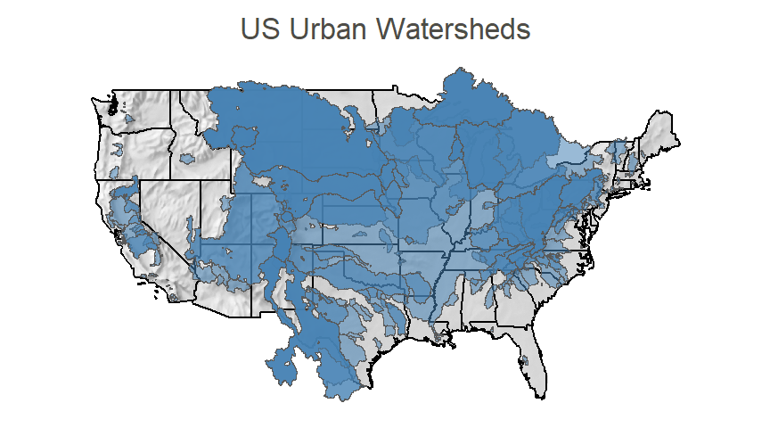
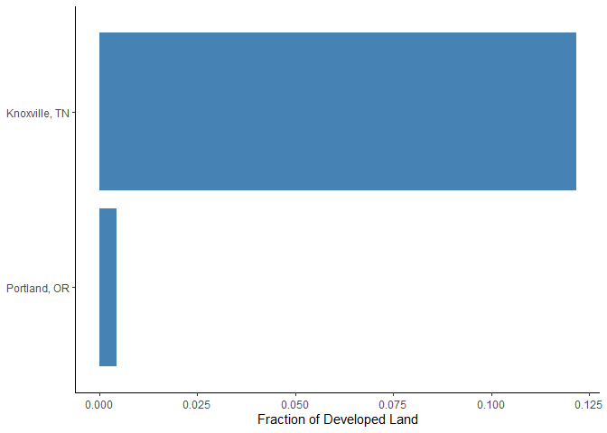

<!-- README.md is generated from README.Rmd. Please edit that file -->


[](https://codecov.io/gh/IMMM-SFA/gamut)
[](https://zenodo.org/badge/latestdoi/203447802)

# `gamut`

#### **G**eospatial **A**nalytics for **M**ultisector **U**rban **T**eleconnections

## Description

`gamut` is a tool for exploring *teleconnections* between cities of the
United States and human activities that occur in their associated water
supply catchments. A *teleconnection* is a causal connection or
correlation between human and environmental phenomena that occur a long
distance apart.

<!-- -->

## Get Started with `gamut`

`gamut` can be installed directly from this repository using the R
`devtools` package. From an R prompt, run the command:

``` r
devtools::install_github('IMMM-SFA/gamut')
```

##### Data Directory Set Up

In order for the package to function properly, the user needs to
correctly set up a data directory, and place all of the necessary
datasets in that directory. The steps below show how to set up the
directory so that the package can read in the input datasets correctly.

    Step 1: In a drive of your choice, create a folder called "data_dir".
    Step 2: Within the "data_dir" folder, create the 3 folders: "energy","land","water". 
            Follow this set up:
            
            Main Folder: data_dir
                  Sub Folder: energy
                  Sub Folder: land
                  Sub Folder: water
    
    Step 3: Follow the instructions in the "Data Downloading Instructions" section below to download the datasets. The             table below shows where to find each dataset, and what folder it needs to go in.

| Teleconnect Name | Sub Folder Location | Full File Path                                                                      | Data Location                                                                                            |
| :--------------- | :------------------ | :---------------------------------------------------------------------------------- | :------------------------------------------------------------------------------------------------------- |
| watersheds       | water               | water/CWM\_v2\_2/World\_Watershed8.shp                                              | <https://knb.ecoinformatics.org/view/doi%3A10.5063%2FF1J67DWR>                                           |
| withdrawal       | water               | water/CWM\_v2\_2/Snapped\_Withdrawal\_Points.shp                                    | <https://knb.ecoinformatics.org/view/doi%3A10.5063%2FF1J67DWR>                                           |
| citypoint        | water               | water/CWM\_v2\_2/City\_Centroid.shp                                                 | <https://knb.ecoinformatics.org/view/doi%3A10.5063%2FF1J67DWR>                                           |
| powerplants      | water               | water/UCS-EW3-Energy-Water-Database.xlsx                                            | <https://www.ucsusa.org/resources/ucs-ew3-energy-water-database>                                         |
| crop             | land                | land/2016\_90m\_cdls/cdl\_lowres\_usa.img                                           | <https://www.nass.usda.gov/Research_and_Science/Cropland/Release/>                                       |
| crop\_attributes | land                | land/2016\_90m\_cdls/cdl\_lowres\_usa.img.vat.dbf                                   | <https://www.nass.usda.gov/Research_and_Science/Cropland/Release/>                                       |
| irrigation       | land                | land/Version2\_USA\_Demeter.csv                                                     | NA                                                                                                       |
| nlud             | land                | land/usa\_nlud\_LR.tif                                                              | <https://drive.google.com/file/d/1vmNfwjcaLf0sZTYJ1wsB3liG37sN8gyC/view>                                 |
| hydro            | energy              | energy/EHA\_Public\_PlantFY2019\_GIS\_6/ORNL\_EHAHydroPlant\_PublicFY2019final.xlsx | <https://hydrosource.ornl.gov/node/250>                                                                  |
| transfers        | NA                  | NA                                                                                  | NA                                                                                                       |
| climate          | land                | land/kop\_climate\_classes.tif                                                      | <http://koeppen-geiger.vu-wien.ac.at/present.htm>                                                        |
| HUC4             | water               | water/USA\_HUC4/huc4\_to\_huc2.shp                                                  | <http://prd-tnm.s3-website-us-west-2.amazonaws.com/?prefix=StagedProducts/Hydrography/WBD/National/GDB/> |
| population       | land                | land/pden2010\_block/pden2010\_60m.tif                                              | <https://www.sciencebase.gov/catalog/item/57753ebee4b07dd077c70868>                                      |
| runoff           | water               | water/Historical\_Mean\_Runoff/USA\_Mean\_Runoff.tif                                | NA                                                                                                       |
| nhd\_flow        | water               | water/Watershed\_Flow\_Contributions/UWB\_Intake\_Flows.shp                         | NA                                                                                                       |
| contributions    | water               | water/Watershed\_Flow\_Contributions/Watershed\_Contributions.csv                   | NA                                                                                                       |

##### Data Downloading Instructions

Below are instructions on how to download each dataset and prepare them
for the package.

    `watersheds`,`withdrawal`,`citypoint` datasets:
      1. Follow the link in the table above and click the Download button across from "CWM_v2_2.zip".
      2. This will download a data file named `knb.1002.1`. Right click and unzip this folder. Go inside the unzipped file, copy the folder named "CWM_v2_2.zip", and place it into the `water` folder.
      
    `powerplants` dataset:
      1. Follow the link in the table above and download the Excel file at the bottom of the page.
      2. After it downloads, place it into the `water` folder.
      
    `crop` and `crop_attributes` datasets:
      1. Follow the link in the table above and download the zipped 2019 CDL file.
      2. This layer requires some processing before it can function properly in the package. In order for the package to run this data, the file size needs to be decreased. We do this by changing the resolution from 30m cells to 90 meter cells.
      3. Open up ArcGIS and load in the CDL file. Run this file through the "Resample" function, and set the cell size to 90 meters by 90 meters.
      4. Once the output is created, run the output through the "Project Raster" function, and change the projection to `GCS_WGS_1984`.
      5. Export the output of this function to `land` folder under the file name of `cdl_lowres_usa`, and set the file type to an IMAGINE image file. This will also produce the `crop_attributes` file. 
      
      `nlud` dataset:
      1: Download the zip file from the google drive listed in the table above. 
      2: Unzip the file, and the remove the TIFs listed below (these are empty):
          - NLUDv1_2010_30m-0000000000-0000000000.tif
          - NLUDv1_2010_30m-0000093184-0000232960.tif
          - NLUDv1_2010_30m-0000093184-0000000000.tif
          - NLUDv1_2010_30m-0000046592-0000232960.tif
          - NLUDv1_2010_30m-0000046592-0000000000.tif
          - NLUDv1_2010_30m-0000000000-0000232960.tif
      3: Change the resolution of these rasters to 90m by 90m, and then mosaic them together. Save the mosaic file to the file path in the table.
      
      `hyrdo` dataset:
      1. Follow the link in the table above and click the download button for the ORNL EHAHydroPlant FY2020revised (xlsx).
      2. After downloading place it into the `energy` folder.
      
      `climate` dataset:
      1. Follow the link in the table above and scroll to the High Resolution Map and Data section.
      2. Click the download link next to R code with raster file.
      3. Crop this raster file to the shape of the Continental United States, and save it as a new TIF file in the `land` folder under the name "koppen_climate_classes.tif".
      
      `population` dataset:
      1. Follow the link in the table above and download the attached file named "pden2010_block.zip". Place this file into the `land` folder.
      2. This raster will also need to be cropped to the shape of the Continental United States.

## Usage

Once all the necessary data is organized in the correct format, the
package is ready to be used. The main function is
`count_watershed_teleconnections`. Within this function, set up your
data directory and select cities. The city names need to be in the
format of `City | State`, and for multiple cities, place them inside
`c()`.

Here is an example of what you would type into your console:

``` r
count_watershed_teleconnections(data_dir = "your/gamut/data_dir", cities = c("Portland | OR", "Charlotte | NC", "Austin | TX"))
```

The package will cycle through each city and their respective
watersheds, and produce a table with several columns of information. To
learn what each of these variables mean, scroll to the bottom of this
section and see the table of variables. The result of this function will
look something like this:

| city          | city\_population | n\_watersheds | n\_other\_cities | dependent\_city\_pop | watershed\_area\_sqkm | storage\_BCM | yield\_BCM | irr\_cons\_BCM | n\_climate\_zones | n\_transfers\_in | n\_transfers\_out | n\_transfers\_within | n\_hydro\_plants | n\_thermal\_plants | n\_fac\_agcrop | n\_fac\_aglivestock | n\_fac\_cnsmnf | n\_fac\_mining | n\_fac\_oilgas | n\_fac\_total | hydro\_gen\_MWh | thermal\_gen\_MWh | thermal\_cons\_BCM | thermal\_with\_BCM | n\_utilities | n\_ba | n\_crop\_classes | cropland\_fraction | developed\_fraction | ag\_runoff\_max | ag\_runoff\_av\_exgw | ag\_runoff\_av | dev\_runoff\_max | dev\_runoff\_av\_exgw | dev\_runoff\_av | np\_runoff\_max | np\_runoff\_av\_exgw | np\_runoff\_av\_exgw\_unweighted | np\_runoff\_av | n\_economic\_sectors | max\_withdr\_dist\_km | avg\_withdr\_dis\_km | n\_treatment\_plants | watershed\_pop | pop\_cons\_m3sec | av\_fl\_sur\_conc\_pct | av\_fl\_sur\_conc\_pct\_unweighted | av\_ro\_sur\_conc\_pct | av\_fl\_all\_conc\_pct | av\_ro\_all\_conc\_pct | av\_fl\_max\_conc\_pct | av\_ro\_max\_conc\_pct | surface\_contribution\_pct | importance\_of\_worst\_watershed\_pct |
| :------------ | ---------------: | ------------: | ---------------: | -------------------: | --------------------: | -----------: | ---------: | -------------: | ----------------: | ---------------: | ----------------: | -------------------: | ---------------: | -----------------: | -------------: | ------------------: | -------------: | -------------: | -------------: | ------------: | --------------: | ----------------: | -----------------: | -----------------: | -----------: | ----: | ---------------: | -----------------: | ------------------: | --------------: | -------------------: | -------------: | ---------------: | --------------------: | --------------: | --------------: | -------------------: | -------------------------------: | -------------: | -------------------: | --------------------: | -------------------: | -------------------: | -------------: | ---------------: | ---------------------: | ---------------------------------: | ---------------------: | ---------------------: | ---------------------: | ---------------------: | ---------------------: | -------------------------: | ------------------------------------: |
| Portland, OR  |           653115 |             1 |                1 |               653115 |              280.7526 |    0.0970009 |  0.3154655 |      0.0000000 |                 4 |               NA |                NA |                   NA |                1 |                  0 |              0 |                   0 |              0 |              0 |              0 |             0 |        55263.24 |                 0 |          0.0000000 |          0.0000000 |            0 |     0 |                0 |          0.0000000 |           0.0044529 |        0.000000 |             0.000000 |       0.000000 |        0.0000172 |             0.0000172 |       0.0000172 |       0.0000172 |            0.0000172 |                        0.0000172 |      0.0000172 |                    4 |             40.923236 |            40.923236 |                    0 |   1.963243e+01 |        0.0000454 |               0.000000 |                           0.000000 |               0.000000 |               0.000000 |               0.000000 |               0.000000 |               0.000000 |                        100 |                                   100 |
| Knoxville, TN |           187500 |             1 |                2 |               159230 |            23196.0276 |    5.1667173 |  0.8121560 |      0.0132724 |                 3 |               NA |                NA |                   NA |               13 |                  4 |              0 |                   7 |            149 |             20 |              0 |           569 |      1633153.23 |           8595014 |          0.0105083 |          0.9841422 |            4 |     4 |                7 |          0.0392887 |           0.1217025 |        0.001735 |             0.001735 |       0.001735 |        0.0187317 |             0.0187317 |       0.0187317 |       0.0204667 |            0.0204667 |                        0.0204667 |      0.0204667 |                   13 |              5.942854 |             5.942854 |                    0 |   1.559519e+06 |        3.6100047 |               1.442118 |                           1.442118 |               1.727607 |               1.442118 |               1.727607 |               1.442118 |               1.727607 |                        100 |                                   100 |

This table can be used to compare different variables between multiple
cities. Below is a graph comparing how much developed land are in
cities’ watersheds.

<!-- -->

`gamut` also has very basic functionality for visualizing watersheds and
associated land uses for a given city watersheds. For example:

``` r
plot_watershed(data_dir = "your/gamut/data_dir", city = "New York | NY")
```

<!-- -->

The table below shows explanations for each of these variables that are
created through this function:

| Variable Name                         | Description                                                                             | Units                 |
| :------------------------------------ | :-------------------------------------------------------------------------------------- | :-------------------- |
| city\_population                      | The population of the city being analyzed                                               | people                |
| n\_watersheds                         | Number of watersheds that city uses to source drinking water                            | watersheds            |
| n\_other\_cities                      | Number of other cities pulling off the same watersheds                                  | cities                |
| dependent\_city\_pop                  | Total population of people dependent on that city’s watersheds                          | people                |
| watershed\_area\_sqkm                 | Combined area of all the source watersheds of a city                                    | square kilometers     |
| storage\_BCM                          | Combined storage capacity of all the city catchments                                    | billion cubic meters  |
| yield\_BCM                            | Combined yield capacity of all the city catchments                                      | billion cubic meters  |
| irr\_cons\_BCM                        | Combined water consumption that is used for irrigation with the watersheds              | billion cubic meters  |
| n\_climate\_zones                     | Number of climate zones that the source watersheds cover                                | zones                 |
| n\_transfers\_in                      | Number of interbasin transfers that flow into the source watersheds                     | transfers             |
| n\_transfers\_out                     | Number of interbasin transfers that flow out of the source watersheds                   | transfers             |
| n\_transfers\_within                  | Number of water transfers that occur within the source watersheds                       | transfers             |
| n\_hydro\_plants                      | Number of hydro electric power plants operating within the source watersheds            | plants                |
| n\_thermal\_plants                    | Number of thermal power plants operating within the source watersheds                   | plants                |
| n\_fac\_agcrop                        | Number of agricultural crop facilities within the source watersheds                     | facilities            |
| n\_fac\_aglivestock                   | Number of agicultural livestock facilities within the source watersheds                 | facilities            |
| n\_fac\_cnsmnf                        | Number of construction and manufacturing facilities within the source watersheds        | facilities            |
| n\_fac\_mining                        | Number of mining facilities within the source watersheds                                | facilities            |
| n\_fac\_oilgas                        | Number of oil and gas facilities within the source watersheds                           | facilities            |
| n\_fac\_total                         | Total number of facilities operating within the source watersheds                       | facilities            |
| hydro\_gen\_MWh                       | Combined hydro electric generation from all the facilities within the source watersheds | Megawatthours         |
| thermal\_gen\_MWh                     | Combined thermal generation from all the facilities within the source watersheds        | Megawatthours         |
| thermal\_cons\_BCM                    | Combined water consumption that is used for thermal generation                          | billion cubic meters  |
| thermal\_with\_BCM                    | Combined water withdrawal for thermal generation                                        | billion cubic meters  |
| n\_utilities                          | Number of electric utilities within the source watersheds                               | utilities             |
| n\_ba                                 | Number of balancing authorities within the source watersheds                            | balancing authorities |
| n\_crop\_classes                      | Total number of different types of crops within the source watersheds                   | crops                 |
| cropland\_fraction                    | Fraction of land that is used for crops within the source watersheds                    | NA                    |
| developed\_fraction                   | Fraction of land that is developed within the source watersheds                         | NA                    |
| ag\_runoff\_max                       | Max amount of agricultural runoff within the source watersheds                          |                       |
| ag\_runoff\_av\_exgw                  |                                                                                         |                       |
| ag\_runoff\_av                        | Average runoff from agricultural lands                                                  |                       |
| dev\_runof\_max                       | Max amount of agricultural runoff within the source watersheds                          |                       |
| dev\_runof\_av\_exgw                  |                                                                                         |                       |
| dev\_runof\_av                        | Average runoff from developed lands                                                     |                       |
| np\_runoff\_max                       | Max amount of non-point source runoff within the source watersheds                      |                       |
| np\_runoff\_av\_exgw                  |                                                                                         |                       |
| np\_runoff\_av\_exgw\_unweighted      |                                                                                         |                       |
| np\_runoff\_av                        | Average non-point source runoff.                                                        |                       |
| n\_economic\_sectors                  | Total number of different economic sectors within the source watersheds                 | sectors               |
| max\_withdr\_dis\_km                  | Maximum distance between a city’s intake points                                         | kilometers            |
| avg\_withdr\_dis\_km                  | Average distance between a city’s intake points                                         | kilometers            |
| n\_treatment\_plants                  | Total number of waste water treatment plants operating within the source watersheds     | plants                |
| watershed\_pop                        | Total number of people living within the source watershed boundaries                    | people                |
| pop\_cons\_m3sec                      | Combined water consumption from the source watersheds that is used for people           | m3/sec                |
| av\_fl\_sur\_conc\_pct                |                                                                                         | %                     |
| av\_fl\_sur\_conc\_pct\_unweighted    |                                                                                         | %                     |
| av\_ro\_sur\_conc\_pct                |                                                                                         | %                     |
| av\_fl\_all\_conc\_pct                |                                                                                         | %                     |
| av\_ro\_all\_conc\_pct                |                                                                                         | %                     |
| av\_fl\_max\_conc\_pct                |                                                                                         | %                     |
| av\_ro\_max\_conc\_pct                |                                                                                         | %                     |
| surface\_contribution\_pct            |                                                                                         | %                     |
| importance\_of\_worst\_watershed\_pct |                                                                                         | %                     |

## Support

For any questions about the package, please contact any of the
contributors below:

Sean Turner: <sean.turner@pnnl.gov>

Kristian Nelson: <kristian.nelson@pnnl.gov>

Chris Vernon <chris.vernon@pnnl.gov>

## Authors and Acknowledgement

Authors: Sean Turner, Kristian Nelson, Chris Vernon, Jennie Rice, Casey
Burleyson, Ryan McManamay, Kerim Dickson

This research was supported by the US Department of Energy, Office of
Science, as part of research in the MultiSector Dynamics, Earth and
Environmental System Modeling Program.
