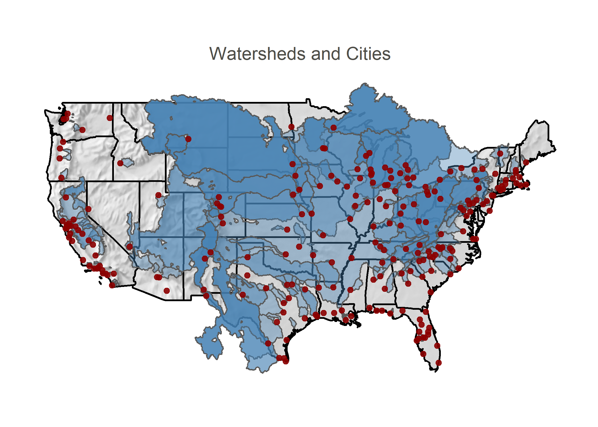
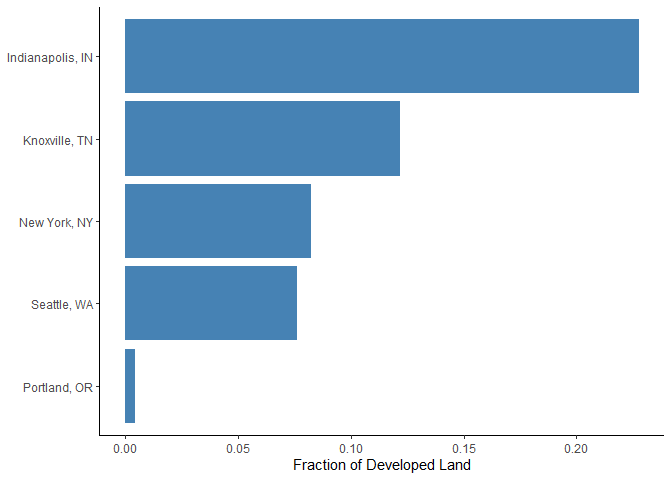

<!-- README.md is generated from README.Rmd. Please edit that file -->


[](https://codecov.io/gh/IMMM-SFA/gamut)
[](https://zenodo.org/badge/latestdoi/203447802)

# `gamut`

## **G**eospatial **A**nalytics for **M**ultisector **U**rban **T**eleconnections

## Description

`gamut` is a tool for exploring *teleconnections* between cities of the
United States and human activities that occur in their associated water
supply catchments. A *teleconnection* is a causal connection or
correlation between human and environmental phenomena that occur a long
distance apart.

<p align="center">



</p>

## Get Started with `gamut`

`gamut` can be installed directly from this repository using the R
`devtools` package. From an R prompt, run the command:

``` r
devtools::install_github('IMMM-SFA/gamut')
library(gamut)
```

##### Data Files

To download all of the `gamut` input datasets, visit the [Zenodo data
repository](https://zenodo.org/record/4662993#.YHTNpehKhPY) and download
the zipped data files to your preferred directory. The table below shows
all the files used within the `gamut` software package.

| gamut Name       | Sub Folder Location | Full File Path                                                                  | Data Source                                                                                              |
| :--------------- | :------------------ | :------------------------------------------------------------------------------ | :------------------------------------------------------------------------------------------------------- |
| watersheds       | water               | water/CWM\_v2\_2/World\_Watershed8.shp                                          | <https://knb.ecoinformatics.org/view/doi%3A10.5063%2FF1J67DWR>                                           |
| withdrawal       | water               | water/CWM\_v2\_2/Snapped\_Withdrawal\_Points.shp                                | <https://knb.ecoinformatics.org/view/doi%3A10.5063%2FF1J67DWR>                                           |
| citypoint        | water               | water/CWM\_v2\_2/City\_Centroid.shp                                             | <https://knb.ecoinformatics.org/view/doi%3A10.5063%2FF1J67DWR>                                           |
| powerplants      | water               | water/UCS-EW3-Energy-Water-Database.xlsx                                        | <https://www.ucsusa.org/resources/ucs-ew3-energy-water-database>                                         |
| crop             | land                | land/2016\_90m\_cdls/cdl\_lowres\_usa.img                                       | <https://www.nass.usda.gov/Research_and_Science/Cropland/Release/>                                       |
| crop\_attributes | land                | land/2016\_90m\_cdls/cdl\_lowres\_usa.img.vat.dbf                               | <https://www.nass.usda.gov/Research_and_Science/Cropland/Release/>                                       |
| irrigation       | land                | land/Version2\_USA\_Demeter.csv                                                 | NA                                                                                                       |
| nlud             | land                | land/usa\_nlud\_LR.tif                                                          | <https://drive.google.com/file/d/1vmNfwjcaLf0sZTYJ1wsB3liG37sN8gyC/view>                                 |
| hydro            | energy              | energy/EHA\_Public\_PlantFY2019\_GIS\_6/ORNL\_EHAHydroPlant\_FY2020revised.xlsx | <https://hydrosource.ornl.gov/node/250>                                                                  |
| climate          | land                | land/kop\_climate\_classes.tif                                                  | <http://koeppen-geiger.vu-wien.ac.at/present.htm>                                                        |
| HUC4             | water               | water/USA\_HUC4/huc4\_to\_huc2.shp                                              | <http://prd-tnm.s3-website-us-west-2.amazonaws.com/?prefix=StagedProducts/Hydrography/WBD/National/GDB/> |
| population       | land                | land/pden2010\_block/pden2010\_60m.tif                                          | <https://www.sciencebase.gov/catalog/item/57753ebee4b07dd077c70868>                                      |
| runoff           | water               | water/Historical\_Mean\_Runoff/USA\_Mean\_Runoff.tif                            | <https://zenodo.org/record/4315195>                                                                      |
| nhd\_flow        | water               | water/Watershed\_Flow\_Contributions/UWB\_Intake\_Flows.shp                     | <https://zenodo.org/record/4315195>                                                                      |
| contributions    | water               | water/Watershed\_Flow\_Contributions/Watershed\_Contributions.csv               | <https://zenodo.org/record/4315195>                                                                      |

## Usage

Once all the necessary data is organized in the correct format, the
package is ready to be used. The main function is
`count_watershed_teleconnections`. Within this function, set up your
data directory and select cities. The city names need to be in the
format of `City | State`, and for multiple cities, place them inside
`c()`.

Here is an example of what you would type into your console:

``` r
count_watershed_teleconnections(data_dir = "your/gamut/data_dir", cities = c("Portland | OR", "Knoxville | TN", "New York | NY", "Indianapolis | IN", "Seattle | WA"))
```

The package will cycle through each city and their respective
watersheds, and produce a table with several columns of information. To
learn what each of these variables mean, scroll to the bottom of this
section and see the table of variables. The result of this function will
look something like this:

| …1 | city             | city\_population | n\_watersheds | n\_other\_cities | dependent\_city\_pop | watershed\_area\_sqkm | storage\_BCM | yield\_BCM | irr\_cons\_BCM | n\_climate\_zones | n\_transfers\_in | n\_transfers\_out | n\_transfers\_within | n\_hydro\_plants | n\_thermal\_plants | n\_fac\_agcrop | n\_fac\_aglivestock | n\_fac\_cnsmnf | n\_fac\_mining | n\_fac\_oilgas | n\_fac\_total | hydro\_gen\_MWh | thermal\_gen\_MWh | thermal\_cons\_BCM | thermal\_with\_BCM | n\_utilities | n\_ba | n\_crop\_classes | cropland\_fraction | developed\_fraction | ag\_runoff\_max | ag\_runoff\_av\_exgw | ag\_runoff\_av | dev\_runoff\_max | dev\_runoff\_av\_exgw | dev\_runoff\_av | np\_runoff\_max | np\_runoff\_av\_exgw | np\_runoff\_av\_exgw\_unweighted | np\_runoff\_av | n\_economic\_sectors | max\_withdr\_dist\_km | avg\_withdr\_dis\_km | n\_treatment\_plants | watershed\_pop | pop\_cons\_m3sec | av\_fl\_sur\_conc\_pct | av\_fl\_sur\_conc\_pct\_unweighted | av\_ro\_sur\_conc\_pct | av\_fl\_all\_conc\_pct | av\_ro\_all\_conc\_pct | av\_fl\_max\_conc\_pct | av\_ro\_max\_conc\_pct | surface\_contribution\_pct | importance\_of\_worst\_watershed\_pct |
| -: | :--------------- | ---------------: | ------------: | ---------------: | -------------------: | --------------------: | -----------: | ---------: | -------------: | ----------------: | :--------------- | :---------------- | :------------------- | ---------------: | -----------------: | -------------: | ------------------: | -------------: | -------------: | -------------: | ------------: | --------------: | ----------------: | -----------------: | -----------------: | -----------: | ----: | ---------------: | -----------------: | ------------------: | --------------: | -------------------: | -------------: | ---------------: | --------------------: | --------------: | --------------: | -------------------: | -------------------------------: | -------------: | -------------------: | --------------------: | -------------------: | -------------------: | -------------: | ---------------: | ---------------------: | ---------------------------------: | ---------------------: | ---------------------: | ---------------------: | ---------------------: | ---------------------: | -------------------------: | ------------------------------------: |
|  1 | Portland, OR     |           653115 |             1 |                1 |               653115 |              280.7526 |    0.0970009 |  0.0930801 |      0.0000000 |                 1 | NA               | NA                | NA                   |                1 |                  0 |              0 |                   0 |              0 |              0 |              0 |             0 |        55263.24 |               0.0 |          0.0000000 |          0.0000000 |            0 |     0 |                0 |          0.0000000 |           0.0044529 |       0.0000000 |            0.0000000 |      0.0000000 |        0.0000172 |             0.0000172 |       0.0000172 |       0.0000172 |            0.0000172 |                        0.0000172 |      0.0000172 |                    4 |             40.923236 |            40.923236 |                    0 |   1.963243e+01 |        0.0000454 |              0.0000000 |                          0.0000000 |              0.0000000 |              0.0000000 |              0.0000000 |               0.000000 |               0.000000 |                        100 |                                   100 |
|  2 | Knoxville, TN    |           187500 |             1 |                2 |               159230 |            23196.0276 |    5.1667173 |  0.2792402 |      0.0132724 |                 2 | NA               | NA                | NA                   |               13 |                  4 |              0 |                   7 |            149 |             20 |              0 |           569 |      1633153.23 |         8595013.6 |          0.0105083 |          0.9841422 |            4 |     4 |                7 |          0.0392887 |           0.1217025 |       0.0017350 |            0.0017350 |      0.0017350 |        0.0187317 |             0.0187317 |       0.0187317 |       0.0204667 |            0.0204667 |                        0.0204667 |      0.0204667 |                   13 |              5.942854 |             5.942854 |                    0 |   1.559519e+06 |        3.6100047 |              1.4421179 |                          1.4421179 |              1.7276066 |              1.4421179 |              1.7276066 |               1.442118 |               1.727607 |                        100 |                                   100 |
|  3 | New York, NY     |          8398748 |             8 |                1 |              8398748 |             5203.8799 |    2.3480124 |  0.7446405 |      0.0046190 |                 3 | NA               | NA                | NA                   |                5 |                  0 |              0 |                   3 |             45 |              7 |              0 |           377 |       155873.63 |               0.0 |          0.0000000 |          0.0000000 |            0 |     0 |                7 |          0.0473016 |           0.0822482 |       0.0207107 |            0.0034037 |      0.0034037 |        0.3966929 |             0.0263228 |       0.0263228 |       0.3966933 |            0.0297265 |                        0.0667699 |      0.0297265 |                   13 |            191.509637 |           130.711473 |                    0 |   2.566443e+05 |        0.5940853 |              0.1757086 |                          0.3212001 |              0.1946581 |              0.1757086 |              0.1946581 |               1.363024 |               1.150314 |                        100 |                                     5 |
|  4 | Indianapolis, IN |           867125 |             2 |                1 |               867125 |             4564.3384 |    0.1120111 |  0.1861601 |      0.0085113 |                 2 | NA               | NA                | NA                   |                0 |                  2 |              0 |                   3 |            226 |             17 |              0 |          2590 |            0.00 |          184897.6 |          0.0001779 |          0.0002461 |            2 |     1 |                7 |          0.6037272 |           0.2275309 |       0.8135638 |            0.7875826 |      0.6536936 |        0.1440485 |             0.1319367 |       0.1095075 |       0.9432512 |            0.9195193 |                        0.8674918 |      0.7632010 |                   11 |             13.022947 |             7.316844 |                    0 |   9.299683e+05 |        2.1527092 |              5.8410899 |                          5.9615696 |              5.1381545 |              4.8481046 |              4.2646682 |               6.137005 |               5.636823 |                         83 |                                    13 |
|  5 | Seattle, WA      |           744955 |             2 |                1 |               744955 |              400.0307 |    0.2083348 |  0.1861601 |      0.0000000 |                 2 | NA               | NA                | NA                   |                1 |                  0 |              0 |                   0 |              0 |              0 |              0 |             0 |        74449.12 |               0.0 |          0.0000000 |          0.0000000 |            0 |     0 |                1 |          0.0000223 |           0.0760191 |       0.0000000 |            0.0000000 |      0.0000000 |        0.0066085 |             0.0059192 |       0.0059192 |       0.0066085 |            0.0059192 |                        0.0054596 |      0.0059192 |                    7 |             48.461821 |            42.872284 |                    0 |   1.245807e+03 |        0.0028838 |              0.0000000 |                          0.0000000 |              0.0000000 |              0.0000000 |              0.0000000 |               0.000000 |               0.000000 |                        100 |                                    70 |

This table can be used to compare different variables between multiple
cities. Below is a graph comparing how much developed land are in
cities’ watersheds.

<!-- -->

The table below shows explanations for each of these variables that are
created through this function:

| Variable Name                         | Description                                                                             | Units                 |
| :------------------------------------ | :-------------------------------------------------------------------------------------- | :-------------------- |
| city\_population                      | The population of the city being analyzed                                               | people                |
| n\_watersheds                         | Number of watersheds that city uses to source drinking water                            | watersheds            |
| n\_other\_cities                      | Number of other cities pulling off the same watersheds                                  | cities                |
| dependent\_city\_pop                  | Total population of people dependent on that city’s watersheds                          | people                |
| watershed\_area\_sqkm                 | Combined area of all the source watersheds of a city                                    | square kilometers     |
| storage\_BCM                          | Combined storage capacity of all the city catchments                                    | billion cubic meters  |
| yield\_BCM                            | Combined yield capacity of all the city catchments                                      | billion cubic meters  |
| irr\_cons\_BCM                        | Combined water consumption that is used for irrigation with the watersheds              | billion cubic meters  |
| n\_climate\_zones                     | Number of climate zones that the source watersheds cover                                | zones                 |
| n\_transfers\_in                      | Number of interbasin transfers that flow into the source watersheds                     | transfers             |
| n\_transfers\_out                     | Number of interbasin transfers that flow out of the source watersheds                   | transfers             |
| n\_transfers\_within                  | Number of water transfers that occur within the source watersheds                       | transfers             |
| n\_hydro\_plants                      | Number of hydro electric power plants operating within the source watersheds            | plants                |
| n\_thermal\_plants                    | Number of thermal power plants operating within the source watersheds                   | plants                |
| n\_fac\_agcrop                        | Number of agricultural crop facilities within the source watersheds                     | facilities            |
| n\_fac\_aglivestock                   | Number of agicultural livestock facilities within the source watersheds                 | facilities            |
| n\_fac\_cnsmnf                        | Number of construction and manufacturing facilities within the source watersheds        | facilities            |
| n\_fac\_mining                        | Number of mining facilities within the source watersheds                                | facilities            |
| n\_fac\_oilgas                        | Number of oil and gas facilities within the source watersheds                           | facilities            |
| n\_fac\_total                         | Total number of facilities operating within the source watersheds                       | facilities            |
| hydro\_gen\_MWh                       | Combined hydro electric generation from all the facilities within the source watersheds | megawatt-hours        |
| thermal\_gen\_MWh                     | Combined thermal generation from all the facilities within the source watersheds        | megawatt-hours        |
| thermal\_cons\_BCM                    | Combined water consumption that is used for thermal generation                          | billion cubic meters  |
| thermal\_with\_BCM                    | Combined water withdrawal for thermal generation                                        | billion cubic meters  |
| n\_utilities                          | Number of electric utilities within the source watersheds                               | utilities             |
| n\_ba                                 | Number of balancing authorities within the source watersheds                            | balancing authorities |
| n\_crop\_classes                      | Total number of different types of crops within the source watersheds                   | crops                 |
| cropland\_fraction                    | Fraction of land that is used for crops within the source watersheds                    | fraction              |
| developed\_fraction                   | Fraction of land that is developed within the source watersheds                         | fraction              |
| ag\_runoff\_max                       | Max amount of agricultural runoff within the source watersheds                          | %                     |
| ag\_runoff\_av\_exgw                  | Average agricultural runoff (excluding ground water)                                    | %                     |
| ag\_runoff\_av                        | Average runoff from agricultural lands                                                  | %                     |
| dev\_runof\_max                       | Max amount of agricultural runoff within the source watersheds                          | %                     |
| dev\_runof\_av\_exgw                  | Average developed runoff (excluding ground water)                                       | %                     |
| dev\_runof\_av                        | Average runoff from developed lands                                                     | %                     |
| np\_runoff\_max                       | Max amount of non-point source runoff within the source watersheds                      | %                     |
| np\_runoff\_av\_exgw                  | Average non-point runoff (excluding ground water)                                       | %                     |
| np\_runoff\_av\_exgw\_unweighted      | Average non-point runoff unweighted (excluding ground water)                            | %                     |
| np\_runoff\_av                        | Average non-point source runoff.                                                        | %                     |
| n\_economic\_sectors                  | Total number of different economic sectors within the source watersheds                 | sectors               |
| max\_withdr\_dis\_km                  | Maximum distance between a city’s intake points                                         | kilometers            |
| avg\_withdr\_dis\_km                  | Average distance between a city’s intake points                                         | kilometers            |
| n\_treatment\_plants                  | Total number of waste water treatment plants operating within the source watersheds     | plants                |
| watershed\_pop                        | Total number of people living within the source watershed boundaries                    | people                |
| pop\_cons\_m3sec                      | Combined water consumption from the source watersheds that is used for people           | m3/sec                |
| av\_fl\_sur\_conc\_pct                | Average surface flow concentration                                                      | %                     |
| av\_fl\_sur\_conc\_pct\_unweighted    | Average surface flow concentration unweighted                                           | %                     |
| av\_ro\_sur\_conc\_pct                | Average surface runoff concentration                                                    | %                     |
| av\_fl\_all\_conc\_pct                | Average flow concentration                                                              | %                     |
| av\_ro\_all\_conc\_pct                | Average runoff concentration                                                            | %                     |
| av\_fl\_max\_conc\_pct                | Max average flow concentration                                                          | %                     |
| av\_ro\_max\_conc\_pct                | Max average runoff concentration                                                        | %                     |
| surface\_contribution\_pct            | Surface contribution                                                                    | %                     |
| importance\_of\_worst\_watershed\_pct | Measures the importance of the watershed with the worst contamination                   | %                     |

## Support

For any questions about the package, please contact any of the
contributors below:

Kristian Nelson: <kristian.nelson@pnnl.gov>

Sean Turner: <sean.turner@pnnl.gov>

Chris Vernon <chris.vernon@pnnl.gov>

## Authors and Acknowledgement

Authors: Kristian Nelson, Sean Turner, Chris Vernon, Jennie Rice, Casey
Burleyson, Ryan McManamay, Kerim Dickson

This research was supported by the US Department of Energy, Office of
Science, as part of research in the MultiSector Dynamics, Earth and
Environmental System Modeling Program.
