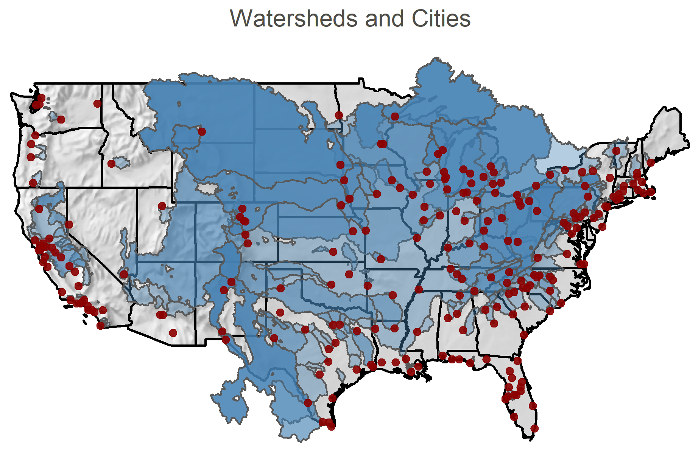

### Summary

Most cities in the United States withdraw surface water for their drinking water supply. The lands on which this water is generated are often developed for human activities—such as agriculture, mining, and industry—that may compete for water resources or cause contamination of water.  The connection between a city and other sectors through its source watersheds is an example of an multisectoral urban teleconnection that is often understood by local utilities but inadequately explored in a national-scale study. The Geospatial Analytics for Multisectoral Urban Teleconnections (``gamut``) package addresses this gap by combining land use data with hydrological analysis to characterize urban source watershed teleconnections across the conterminous United States. Figure 1 gives a visual of the extent of the watersheds and cities analyzed in this package.

  

  Figure 1: Watersheds and cities that are analyzed within the ``gamut`` package. Watershed delineations and city points gathered from [@McDonald:2014]. Hillshade map made from Natural Earth.

  

&nbsp;
                                        
  The ``gamut`` package computes dozens of city-level metrics that inform on the nature of surface water supply catchments and the presence, intensity, and impact of human activities in those catchments (Figure 1). Each city’s watershed is defined using the Urban Water Blueprint [@McDonald:2014], which is enhanced with source contribution estimates as well as river flow and high-resolution runoff [@Nelson:2021]. Watershed delineations are used to mask geospatial land use layers. Various sectors are considered, including electricity generation, agriculture, industry and other economic developments, and water infrastructure (dams, reservoirs, aqueducts). 

Metrics reported by ``gamut`` fall into four main categories: geographical characteristics of watersheds (e.g., climate zones, land area, distance from city, hydrology), potential water contamination concentrations (nonpoint and point), withdrawal/consumption of water from other sectors, and presence/intensity of multisectoral land uses. Table 1 shows all of the metrics that are created by this package, descriptions, and units. We provide an R vignette step-by-step tutorial for users to get started with ``gamut`` which is accessible here:  [Tutoral](https://github.com/IMMM-SFA/gamut#readme). 

Table 1: This table shows explanations for each of these variables that are created through this function:

| Variable Name                         | Description                                                                             | Units                 |
| :------------------------------------ | :-------------------------------------------------------------------------------------- | :-------------------- |
| city\_population                      | The population of the city being analyzed                                               | people                |
| n\_watersheds                         | Number of watersheds that city uses to source drinking water                            | watersheds            |
| n\_other\_cities                      | Number of other cities pulling off the same watersheds                                  | cities                |
| dependent\_city\_pop                  | Total population of people dependent on that city’s watersheds                          | people                |
| watershed\_area\_sqkm                 | Combined area of all the source watersheds of a city                                    | square kilometers     |
| storage\_BCM                          | Combined storage capacity of all the city catchments                                    | billion cubic meters  |
| yield\_BCM                            | Combined yield capacity of all the city catchments                                      | billion cubic meters  |
| irr\_cons\_BCM                        | Combined water consumption that is used for irrigation with the watersheds              | billion cubic meters  |
| n\_climate\_zones                     | Number of climate zones that the source watersheds cover                                | zones                 |
| n\_transfers\_in                      | Number of interbasin transfers that flow into the source watersheds                     | transfers             |
| n\_transfers\_out                     | Number of interbasin transfers that flow out of the source watersheds                   | transfers             |
| n\_transfers\_within                  | Number of water transfers that occur within the source watersheds                       | transfers             |
| n\_hydro\_plants                      | Number of hydro electric power plants operating within the source watersheds            | plants                |
| n\_thermal\_plants                    | Number of thermal power plants operating within the source watersheds                   | plants                |
| n\_fac\_agcrop                        | Number of agricultural crop facilities within the source watersheds                     | facilities            |
| n\_fac\_aglivestock                   | Number of agicultural livestock facilities within the source watersheds                 | facilities            |
| n\_fac\_cnsmnf                        | Number of construction and manufacturing facilities within the source watersheds        | facilities            |
| n\_fac\_mining                        | Number of mining facilities within the source watersheds                                | facilities            |
| n\_fac\_oilgas                        | Number of oil and gas facilities within the source watersheds                           | facilities            |
| n\_fac\_total                         | Total number of facilities operating within the source watersheds                       | facilities            |
| hydro\_gen\_MWh                       | Combined hydro electric generation from all the facilities within the source watersheds | Megawatthours         |
| thermal\_gen\_MWh                     | Combined thermal generation from all the facilities within the source watersheds        | Megawatthours         |
| thermal\_cons\_BCM                    | Combined water consumption that is used for thermal generation                          | billion cubic meters  |
| thermal\_with\_BCM                    | Combined water withdrawal for thermal generation                                        | billion cubic meters  |
| n\_utilities                          | Number of electric utilities within the source watersheds                               | utilities             |
| n\_ba                                 | Number of balancing authorities within the source watersheds                            | balancing authorities |
| n\_crop\_classes                      | Total number of different types of crops within the source watersheds                   | crops                 |
| cropland\_fraction                    | Fraction of land that is used for crops within the source watersheds                    | NA                    |
| developed\_fraction                   | Fraction of land that is developed within the source watersheds                         | NA                    |
| ag\_runoff\_max                       | Max amount of agricultural runoff within the source watersheds                          |                       |
| ag\_runoff\_av\_exgw                  |                                                                                         |                       |
| ag\_runoff\_av                        | Average runoff from agricultural lands                                                  |                       |
| dev\_runof\_max                       | Max amount of agricultural runoff within the source watersheds                          |                       |
| dev\_runof\_av\_exgw                  |                                                                                         |                       |
| dev\_runof\_av                        | Average runoff from developed lands                                                     |                       |
| np\_runoff\_max                       | Max amount of non-point source runoff within the source watersheds                      |                       |
| np\_runoff\_av\_exgw                  |                                                                                         |                       |
| np\_runoff\_av\_exgw\_unweighted      |                                                                                         |                       |
| np\_runoff\_av                        | Average non-point source runoff.                                                        |                       |
| n\_economic\_sectors                  | Total number of different economic sectors within the source watersheds                 | sectors               |
| max\_withdr\_dis\_km                  | Maximum distance between a city’s intake points                                         | kilometers            |
| avg\_withdr\_dis\_km                  | Average distance between a city’s intake points                                         | kilometers            |
| n\_treatment\_plants                  | Total number of waste water treatment plants operating within the source watersheds     | plants                |
| watershed\_pop                        | Total number of people living within the source watershed boundaries                    | people                |
| pop\_cons\_m3sec                      | Combined water consumption from the source watersheds that is used for people           | m3/sec                |
| av\_fl\_sur\_conc\_pct                |                                                                                         | %                     |
| av\_fl\_sur\_conc\_pct\_unweighted    |                                                                                         | %                     |
| av\_ro\_sur\_conc\_pct                |                                                                                         | %                     |
| av\_fl\_all\_conc\_pct                |                                                                                         | %                     |
| av\_ro\_all\_conc\_pct                |                                                                                         | %                     |
| av\_fl\_max\_conc\_pct                |                                                                                         | %                     |
| av\_ro\_max\_conc\_pct                |                                                                                         | %                     |
| surface\_contribution\_pct            |                                                                                         | %                     |
| importance\_of\_worst\_watershed\_pct |                                                                                         | %                     |
      |
### Statement of Need

MultiSector Dynamics (MSD) research seeks to improve scientific understanding of the co-evolution of human and natural systems. This research applies infrastructure expansion and land use scenarios, resource demand projections, and multisectoral modeling to capture the effects of interconnected systems on human vulnerability to trends and shocks. The ``gamut`` package offers new data that meet a number of MSD needs. The package may be used to infer possible water resources expansion strategies for major cities in the United States. For example, cities found to be heavily exposed to potential contamination may be more likely to seek alternative means of supply (e.g., water transfers) or invest in water reuse facilities. ``gamut`` also reveals which source watersheds are heavily protected by receiving cites. This information can inform land use and energy expansion scenarios applied in MSD research, for example by preventing significant expansion of human developments in protected source watersheds. ``gamut`` may also be used in large-scale hydrological modeling to correctly assign urban water demands to specific intakes.

The ``gamut`` package is open source and may be downloaded using the [devtools](https://devtools.r-lib.org/) package.

`devtools::install_github("https://github.com/IMMM-SFA/gamut.git")`

### Dependencies 

Imports: 
    clisymbols,
    crayon,
    dams,
    dataRetrieval,
    dplyr,
    exactextractr,
    foreign,
    geosphere,
    ggplot2,
    lwgeom,
    magrittr,
    purrr,
    raster,
    readxl,
    reservoir,
    rgdal,
    rgeos,
    sf,
    sp,
    stringr,
    tibble,
    tidyr,
    units,
    vroom

Suggests: 
    testthat (>= 2.1.0),
    knitr,
    rmarkdown

VignetteBuilder: knitr

### Acknowledgements

This research was supported by the U.S. Department of Energy, Office of Science, as part of research in MultiSector Dynamics, Earth and Environmental System Modeling Program.

### References 

